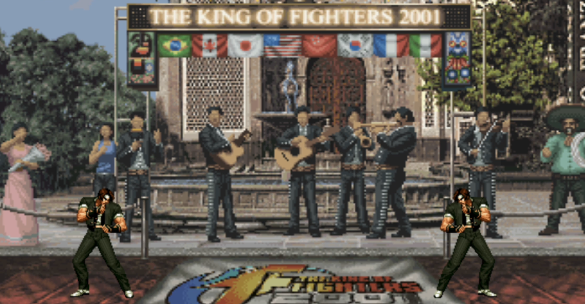
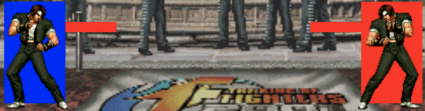

<h1 align="center">King of Fighters</h1>

<h2 align="center"><a  href="https://youtu.be/HRxvA9wOfb8">View a Demo</a></h2>

## Description

A horizontal fighting game based on CSS, jQuery and JavaScript ES6. Two players share a keyboard to fight against each other. I implemented a character (Kyo Kusanagi) which has four actions and seven states. 

**The King of Fighters inspires this project** .

## How to play

- **Share** a keyboard.
  | Character Movements | Player 1 |  Player 2  |
  | :-----------------: | :------: | :--------: |
  |        Jump         |    w     |  ArrowUp   |
  |      Go Right       |    d     | ArrowRight |
  |       Go Left       |    a     | ArrowLeft  |
  |    Throw a Punch    |  Space   |   Enter    |
- **Beat** your opponent before the countdown ends.

## About the project

### CSS

- Build a game page with HP bars and countdown using flexbox for layout, float to adjust position, multiple type selectors and calc() for dynamic calculations.

### jQuery

- Simplified development by using jQuery to filter/add/find elements, jQuery event methods, and jQuery animate() to effect the fading animation of HP bars after being attacked.

  

### Finite-state Machine

- Designed a finite-state machine, including a state collection, a set of state transitions and the current state variable, and by setting events listeners and character variables such as initial position, direction, speed and gravity etc., make characters have seven reasonable and smooth animations.
- 0: idle, 1: forward, 2: backward, 3: jump, 4: attack, 5: be hit, 6: death

### Collision Detection

- Used Axis-Aligned Bounding Box for collision detection to achieve attack, attacked and death effects.

## Project setup

- Download the Live Server plugin in your IDE.
- Right-click on the index.html file to open it with Live Server, and this static web game will appear in your browser.

## Future scope

- Add other characters.
- Add character skills.